<p align="center"> 
    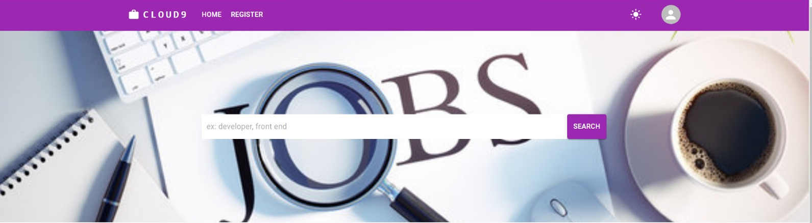</img>
</p>

<h1 align="center"> Cloud9: Cloud Based Job portal ☁️ </h1> 
<h3 align="center"> Revolutionizing recruitment with a cloud-based ATS for seamless job applications and efficient candidate selection </h3>

<p align="center">
    <a href="https://reactjs.org/"></a>
    <a href="https://redux.js.org/"></a>
    <a href="https://mui.com/"></a>
    <a href="https://nodejs.org/"></a>
    <a href="https://expressjs.com/"></a>
    <a href="https://mongoosejs.com/"></a>
    <a href="https://www.npmjs.com/package/jsonwebtoken"></a>
    <a href="https://aws.amazon.com/"></a>
</p>

<!-- <p align="center">If you want to discuss something, you can ask on my <a href="https://discord.com/invite/GkcbM5bwZr">Discord Server</a>.</p> -->

# 🖥️ Installation

- Download the latest Node.js version from [here](https://nodejs.org/en/download/) and npm will be installed with nodejs.

- Clone the repository

  ```sh
  git clone <repo_link>
  ```

- Navigate to the project directory
- Install the required dependencies
  ```sh
  npm install
  ```
- Start the app

  ```sh
   npm start
  ```

- Runs the app in the development mode.\
  Open [http://localhost:3000](http://localhost:3000) to view it in your browser.

# ▶️ Demo

To experience the functionality of our cloud-based Applicant Tracking System (ATS), follow the steps below:

## User Registration and Login

- **User Registration**: New users can register by filling in their details, including name, email, and password. This initial setup creates a user profile within the system.
  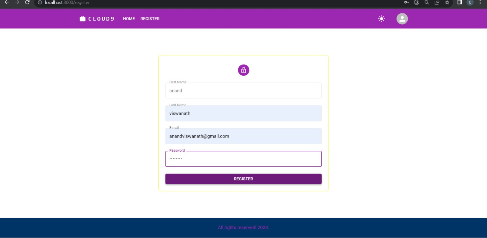
- **User Login**: Registered users can securely log in using their credentials, providing access to their personalized dashboard and features.
  .png>)

## User Dashboard

- **Dashboard Overview**: After logging in, users are directed to a dashboard that displays all active job applications, personal details, and the status of each application.

  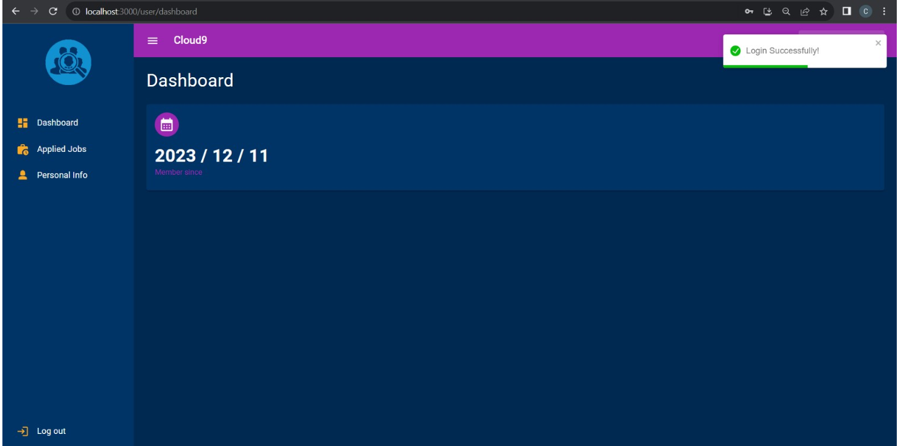

- **Job Search and Application**: Users can browse available job listings, view details, and apply directly from the dashboard. The application process includes submitting a resume and other required information.

  .png>)
  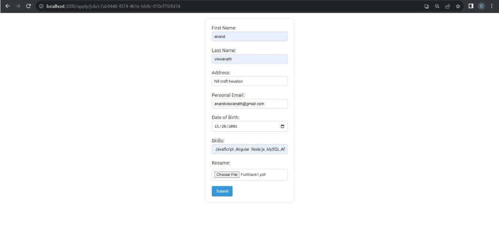

## Admin Login and Dashboard

- **Admin Login**: Administrators log in using a secure, predefined account. The admin interface is protected by Amazon Cognito, ensuring secure authentication.
  .png>)
- **Admin Dashboard**: The dashboard provides a comprehensive overview of the platform's activity. Admins can manage job listings, view applicant information, and use advanced filtering tools to streamline the recruitment process.
  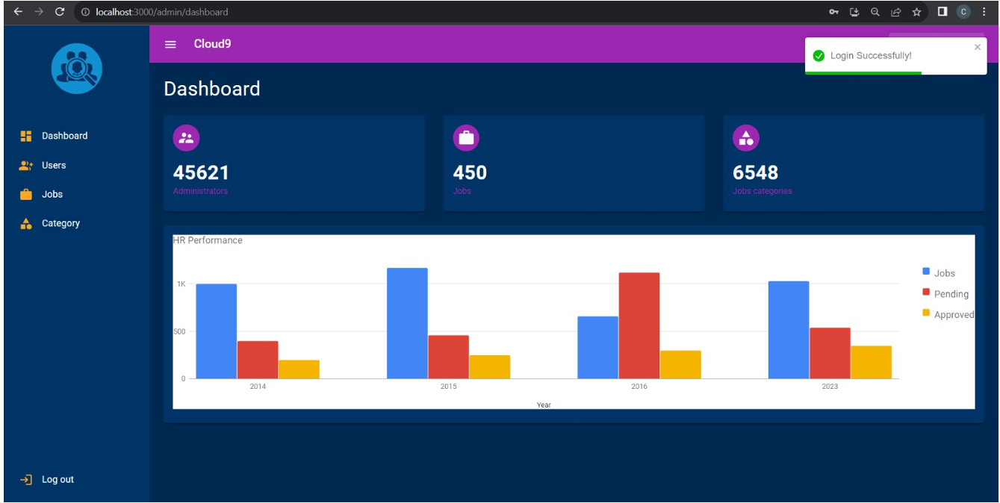
- **Job Management**: Admins can create, update, and delete job postings. The system allows for easy modification of job details to keep listings current and accurate.
  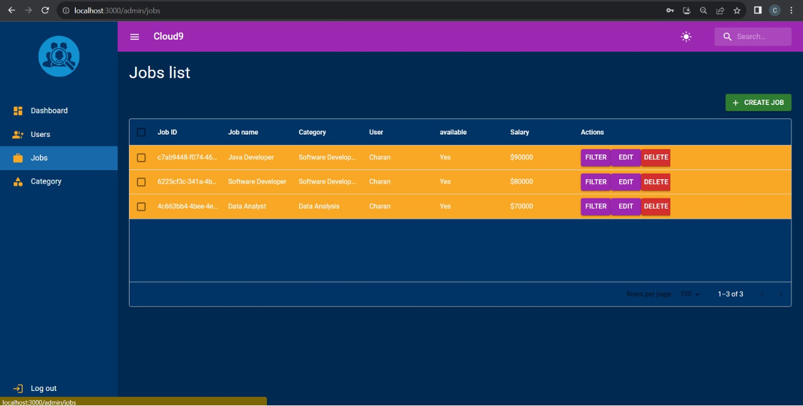
  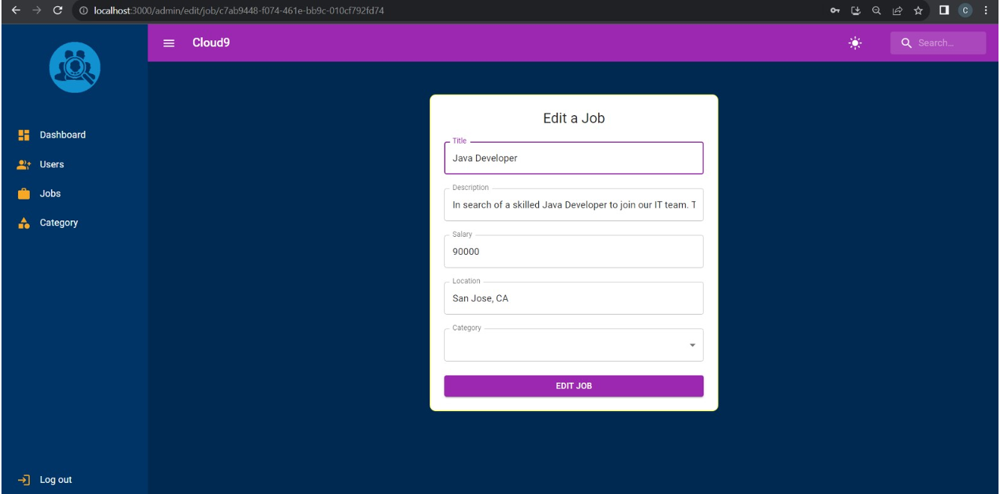
- **Candidate Filtering**: The admin dashboard includes a filtering function that leverages AWS Lambda to match candidates with job requirements, presenting a shortlist of the most qualified applicants.
  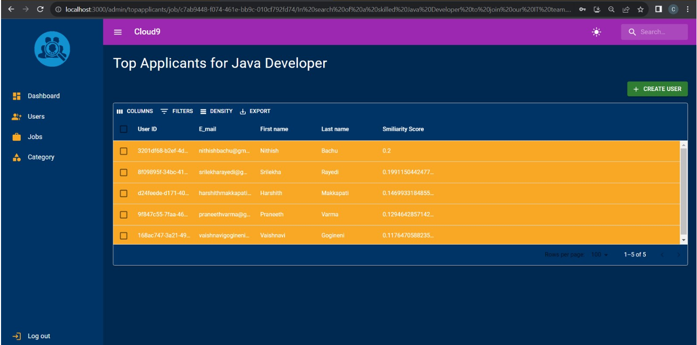

## Advanced Filtering and Candidate Selection

- **Filtering Mechanism**: The system uses a serverless architecture with AWS Lambda to filter candidates based on predefined criteria. This includes analyzing resumes and application details to generate a similarity score.
- **Top Candidates**: The top candidates for each position are highlighted, allowing admins to focus on the best matches. This feature streamlines the selection process, making it efficient and accurate.
  

## 📋 Key Features

- **User-Friendly Interface**: The ATS platform features a sleek and intuitive design, making it easy for users to navigate and apply for jobs.
- **Secure Authentication**: Using Amazon Cognito, the system ensures secure and reliable user authentication, protecting user data.
- **Comprehensive Admin Tools**: Admins have full control over the job listings and can efficiently manage applications and candidates.
- **Serverless Architecture**: The application utilizes AWS services such as Lambda, S3, DynamoDB, and Elastic Beanstalk to deliver a scalable and reliable backend.
- **Data Management**: AWS S3 is used for storing resumes, while DynamoDB manages user and job data, ensuring efficient data retrieval and management.
- **Email Notifications**: Integrates with Amazon SES to automatically notify top candidates selected by the system, enhancing communication and engagement.

# Technologies Used

## Frontend

- **React**: Core library for building the user interface.
- **Redux**: State management for React applications.
- **AWS Amplify**: Platform for hosting the frontend and managing backend integrations.
- **Material-UI**: Component library for creating a consistent and responsive UI.

## Backend

- **Node.js**: JavaScript runtime for backend development.
- **Express**: Web framework for building APIs and backend services.
- **Mongoose**: Object Data Modeling (ODM) library for MongoDB.
- **JWT (jsonwebtoken)**: For authentication and authorization using JSON Web Tokens.

## AWS Services

- **AWS API Gateway**: Manages API requests and routes them to backend services.
- **AWS Lambda**: Serverless compute service for executing backend logic.
- **AWS Elastic Beanstalk**: Deploys and manages the Node.js backend application.
- **Amazon S3**: Object storage service for storing files and data.
- **Amazon DynamoDB**: NoSQL database service for data storage and retrieval.
- **Amazon Cognito**: User authentication and management.
- **AWS IAM**: Manages user permissions and access to AWS resources.

# 🚀 Technical Details

## 💡 High-level System Architecture

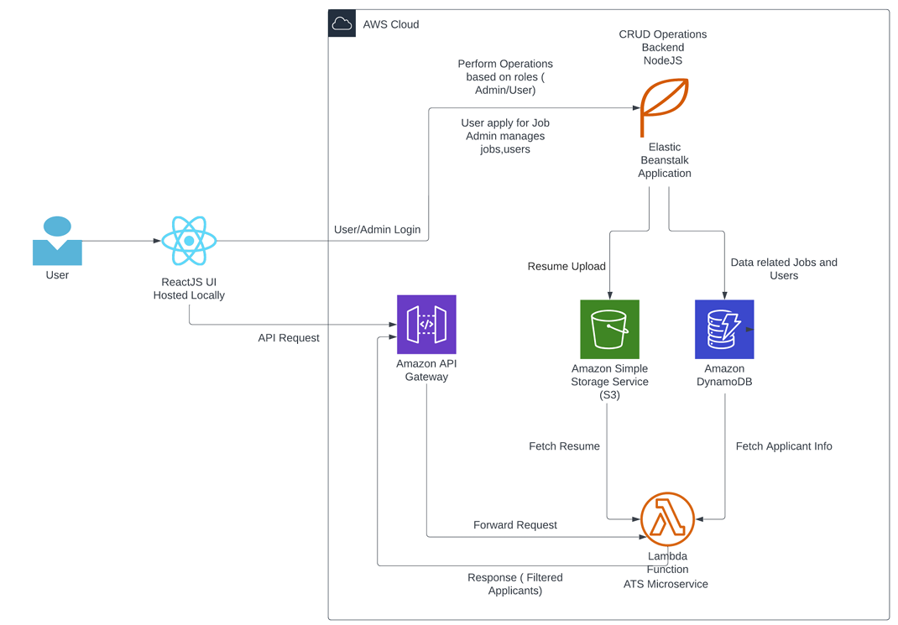

### Frontend

- **React**: The React application is maintained and deployed using AWS Amplify for enhanced security and performance.

### Backend

- **AWS Elastic Beanstalk**: This service hosts the Node.js backend application, handling CRUD operations for job listings and user management.
- **Amazon S3**: Continued use for secure file storage, ensuring scalable data management.
- **Amazon DynamoDB**: Utilized for efficient data handling, managing user data, job postings, and application details.
- **AWS Lambda**: Specialized functions are maintained for operations like filtering candidates based on job requirements.

### Security and Data Flow

- The architecture includes robust data flow management, ensuring secure and efficient data transfer between the frontend and backend services, with a focus on maintaining data integrity and user privacy.

## 🛠️ Low-level implementation details

### Amazon API Gateway

Handles API requests from the React frontend, managing authentication and routing to AWS Lambda for backend processing.
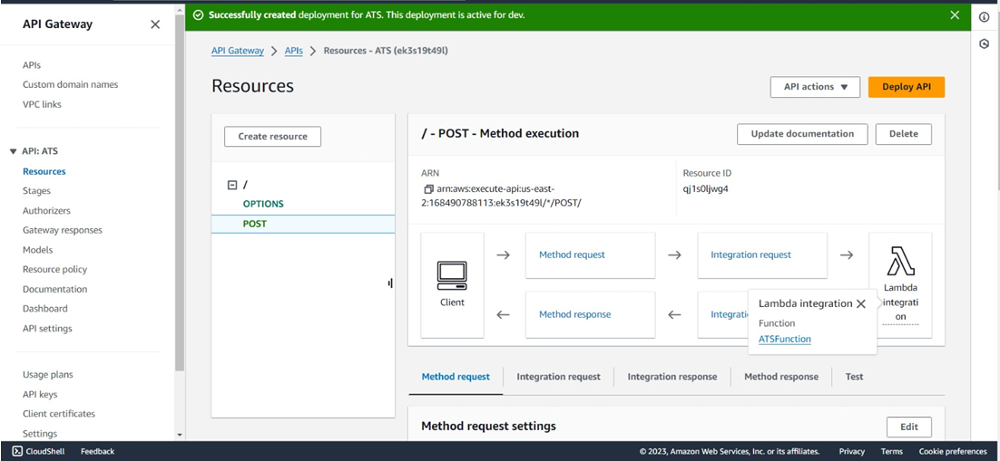

### AWS Elastic Beanstalk

Hosts the Node.js backend, facilitating CRUD operations for job listings and user management, with automated server management.
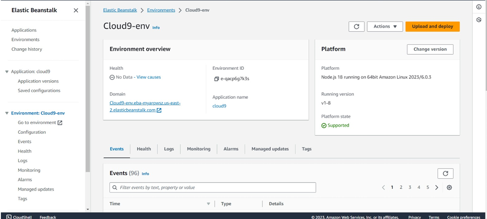

### AWS Lambda

Executes serverless functions for tasks like filtering job applicants, triggered by API Gateway requests.
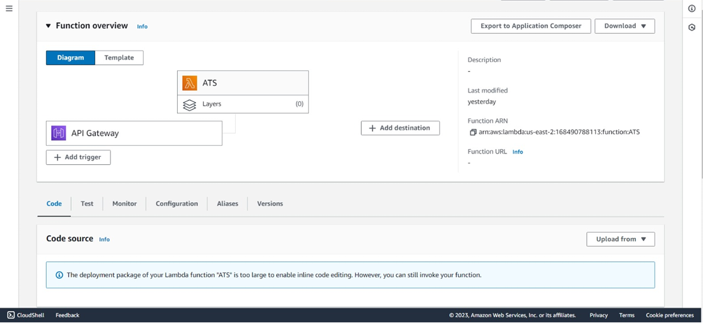

### AWS DynamoDB

NoSQL database managing data across multiple tables, including users, jobs, and applications, ensuring efficient data storage and retrieval.
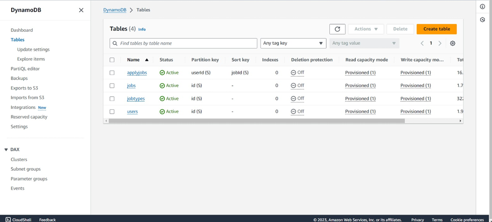

### AWS S3

Primary storage for resumes and uploaded files, providing secure and scalable cloud storage.
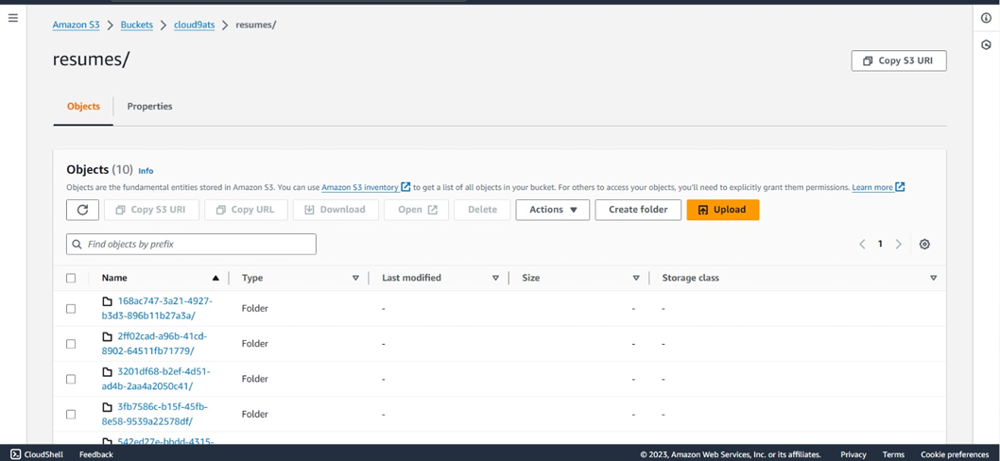

### Identity and Access Management (IAM)

Controls access to AWS resources, managing user permissions and ensuring secure access to services like DynamoDB and S3.
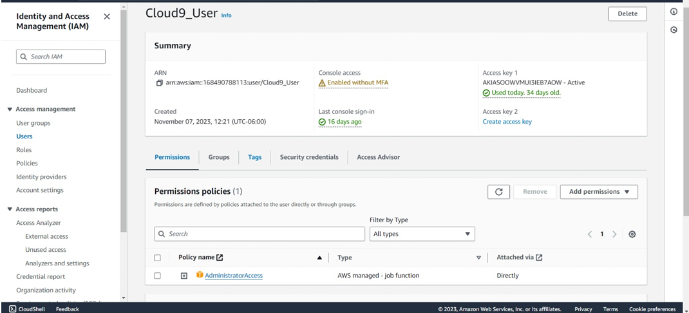

# Contributors 

<table>
  <tbody>
    <tr>
      <td align="center">
        <a href="https://github.com/charangajjala" target="_blank">
          
          <br />
          <sub><b>Charan Gajjala Chenchu</b></sub>
        </a>
      </td>
      <td align="center">
        <a href="https://github.com/sachinveera625"
          target="_blank">
          
          <br />
          <sub><b>Sachin Veeramalla</b></sub>
        </a>
      </td>
  </tbody>
</table>

# 🎟️ License

This project is licensed under the MIT License - see the [License](LICENSE) file for details.

# 📜 References & Acknowledgement

1. **AWS Documentation**  
   Comprehensive documentation for all AWS services, providing detailed information on usage and best practices. [AWS Documentation](https://docs.aws.amazon.com/) .

2. **Lever Case Study**  
   A case study demonstrating the implementation of an ATS using AWS, highlighting practical applications and architecture. [Lever Case Study](https://aws.amazon.com/solutions/casestudies/lever-case-study/) .

3. **Jobvite Blog - What is an Applicant Tracking System?**  
   An insightful article that explains the role and benefits of ATS in modern recruitment processes. [Jobvite Blog](https://www.jobvite.com/blog/what-is-an-applicant-tracking-system/) .

4. **Fresh Tech Talent ATS**  
   A GitHub repository showcasing an example of an ATS implementation using the MERN stack, demonstrating practical coding applications. [Fresh Tech Talent ATS](https://github.com/ViggoMode2021/Fresh_Tech_Talent_ATS) .

5. **Job Portal MERN Stack Implementation**  
   A GitHub repository detailing a job portal built using the MERN stack, highlighting various functionalities and design considerations. [Job Portal MERN Stack](https://github.com/emmannweb/job-portal-mern-stack) .

6. **Building Serverless Applications**  
   A comprehensive guide to building serverless applications with AWS Amplify, API Gateway, Lambda, and Cognito, including deployment strategies. [Building Serverless Applications](https://medium.com/rahasak/build-serverless-application-with-aws-amplify-aws-api-gateway-aws-lambda-and-cognito-auth-a8606b9cb025) .
